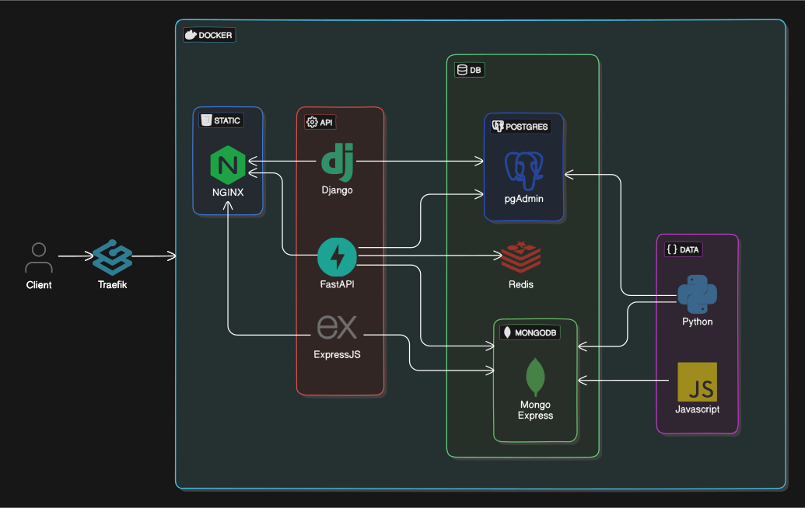
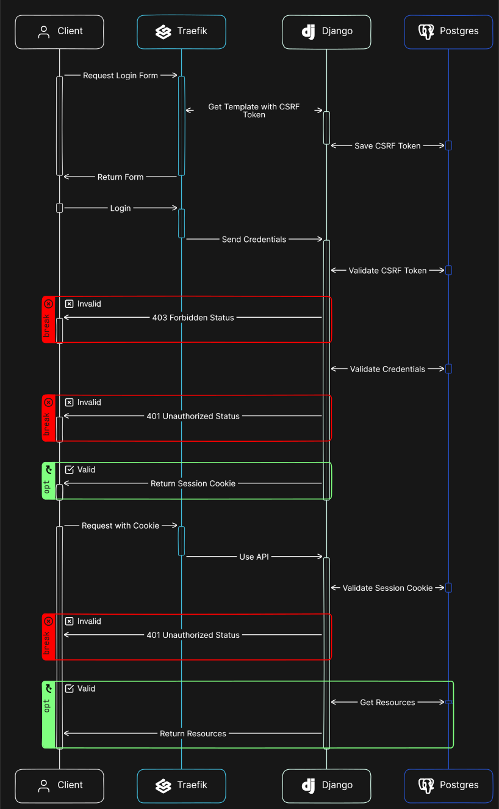
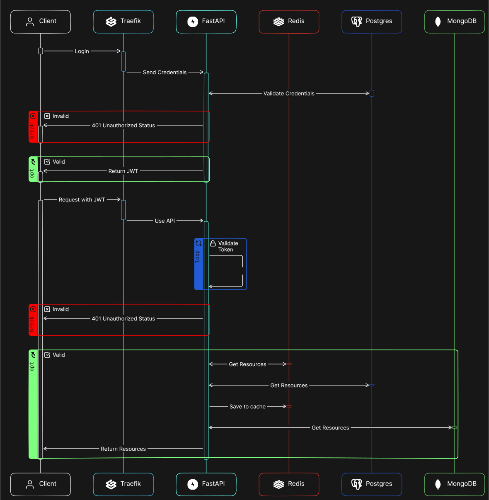

# Database APIs

This repository hosts a collection of Database APIs developed in both Python and JavaScript, showcasing a versatile range of options for database interaction, including a data generators for creating synthetic data to aid in testing and development.

## Overview

### Frontend

- **Static Files in NGINX**: Utilized for Jinja templates and assets to ensure tailored styling and minimize redundancy.

- **Bootstrap**: Employed for EJS Template, ensuring responsive and visually appealing user interfaces.

- **Traefik Reverse Proxy**: Facilitates routing and load balancing for incoming requests.

> Note: Some ad blockers and browsers may restrict AJAX requests to \*.localhost endpoints when using Traefik. Consider temporarily disabling them or configuring the proxy to use a public domain.

### APIs

- **Django**: A high-level Python web framework that encourages rapid development and clean, pragmatic design.

- **FastAPI**: A fast and modern web framework for building APIs leveraging Python type hints for robust data integrity.

- **ExpressJS**: A flexible and minimalist web application framework for Node.js, providing a robust set of features for APIs using NoSQL databases.

### Database

- **Redis**: Includes a Management Dashboard for efficient data monitoring

- **MongoDB**: Features a Mongo Express Dashboard for intuitive database oversight.

- **Postgres**: Incorporates a pgAdmin4 Dashboard for comprehensive database administration.

### Data Generator

- **Python**: This program offers a straightforward solution for generating fictitious data suitable for both SQL and NoSQL databases.

- **JavaScript**: Specifically tailored for NoSQL database systems, this application simplifies the generation of synthetic data using FakerJS.

## Security

### Django

In the Django implementation, security measures include:

- **Session Authentication**: Mitigate cross-site forgery attacks with Django's built-in session token functionality.

- **Templates View and LoginMixin**: Ensure secure rendering of user-controlled views for enhanced protection.

### FastApi

The FastAPI implementation prioritizes security through:

- **JSON Web Token (JWT)**: Provides secure authentication for accessing CRUD APIs.

- **CRUD Controllers**: Enhance security measures by controlling access to sensitive data.

- **Data Access Layers**: Ensure the secure rendering of Model Relations by leveraging both Synchronous and Asynchronous Endpoints, tailored to accommodate the needs of both SQL and NoSQL Databases.

- **PyTest Configuration**: Enables thorough testing of synchronous endpoints for robustness and reliability.

## Architecture Summary



### Session Workflow



### JWT Workflow



## Getting Started

Before diving in, ensure seamless setup with the following steps:

1. Copy `.env.example` to `.env` for optimal configuration.

1. Fulfill the following prerequisites:

   - Docker: Recommended for streamlined setup and deployment.
   - Python 3.10+: Essential for local development and execution.
   - NodeJS 20+: Beneficial for local development and testing.

## Additional Information

For further details and assistance, execute the following command:

```bash
bash run.sh -h
```

> Known Issues: MongoDB may sometimes fail to configure the root user correctly, and Postgres might encounter SSL initialization issues upon Docker startup. Typically, executing `./reset.sh && ./run.sh -sc ` can resolve these issues. If the problem persists, try restarting your Docker engine.
